# StatMiner MVP Architecture & Go-to-Market Plan

> **From Architecture to Market: Cheapest Path to Production**
> 
> Based on competitor analysis of 20+ data platforms including LiteLLM, Metabase, Superset, Grafana, and Airbyte

---

## Executive Summary

StatMiner sits at the intersection of **3 major trends**:
1. **Multi-LLM Orchestration** (LiteLLM: 32K⭐, LangChain: 122K⭐)
2. **Self-Service BI/Analytics** (Metabase: 45K⭐, Superset: 69K⭐)
3. **Data Source Aggregation** (Airbyte: 20K⭐, Meltano: 2.3K⭐)

**Unique Value Proposition**: AI-powered data aggregation from government/academic APIs with multi-LLM analysis and Neo4j visualization—something no single competitor offers.

---

## Competitor Landscape Analysis

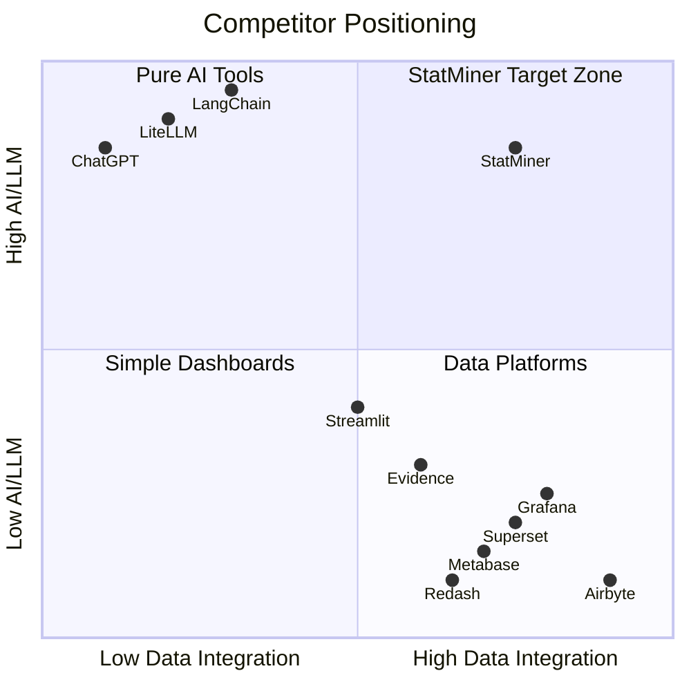

### Key Differentiators from Competitors

| Feature | LiteLLM | Metabase | Airbyte | StatMiner |
|---------|---------|----------|---------|-----------|
| Multi-LLM Support | ✅ 100+ | ❌ | ❌ | ✅ 4+ |
| Data Visualization | ❌ | ✅ | ❌ | ✅ |
| Gov/Academic APIs | ❌ | ❌ | Partial | ✅ |
| Graph Database | ❌ | ❌ | ❌ | ✅ Neo4j |
| Data Validation | ❌ | Basic | ✅ | ✅ |
| Self-Hosted | ✅ | ✅ | ✅ | ✅ |
| BYO API Keys | ✅ | N/A | N/A | ✅ |

---

## MVP Architecture (Cheapest Path)

### High-Level System Architecture

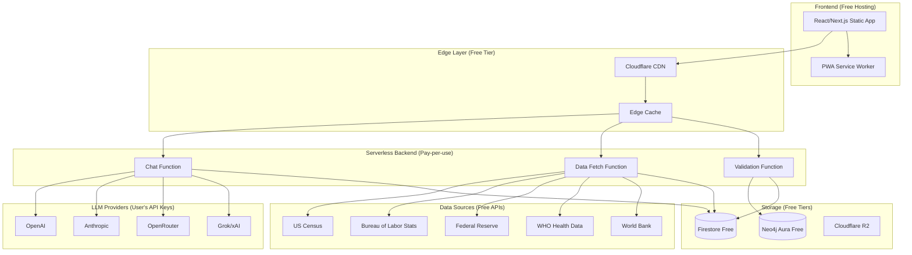

### Data Flow Architecture

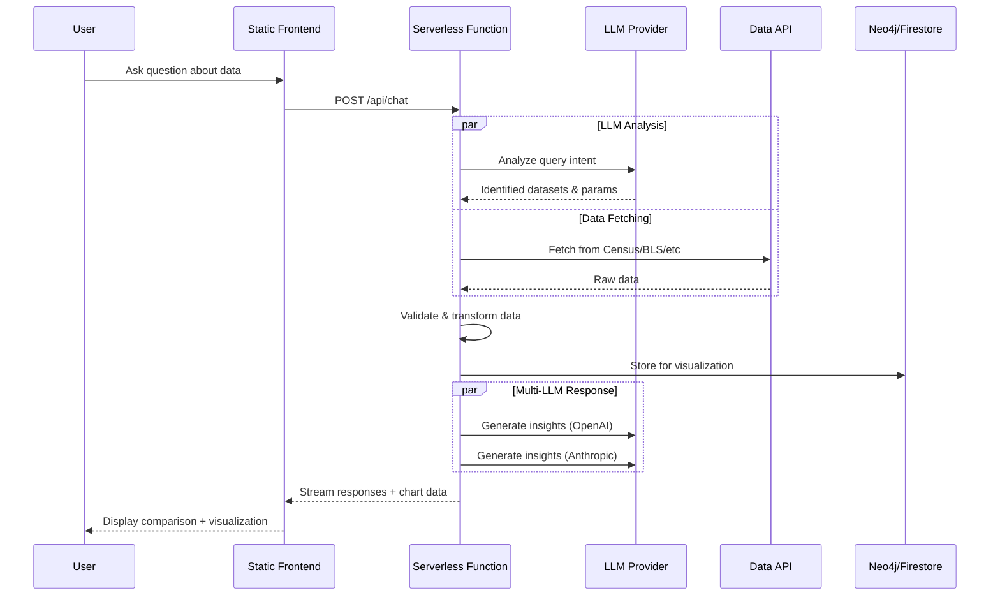

### Component Architecture

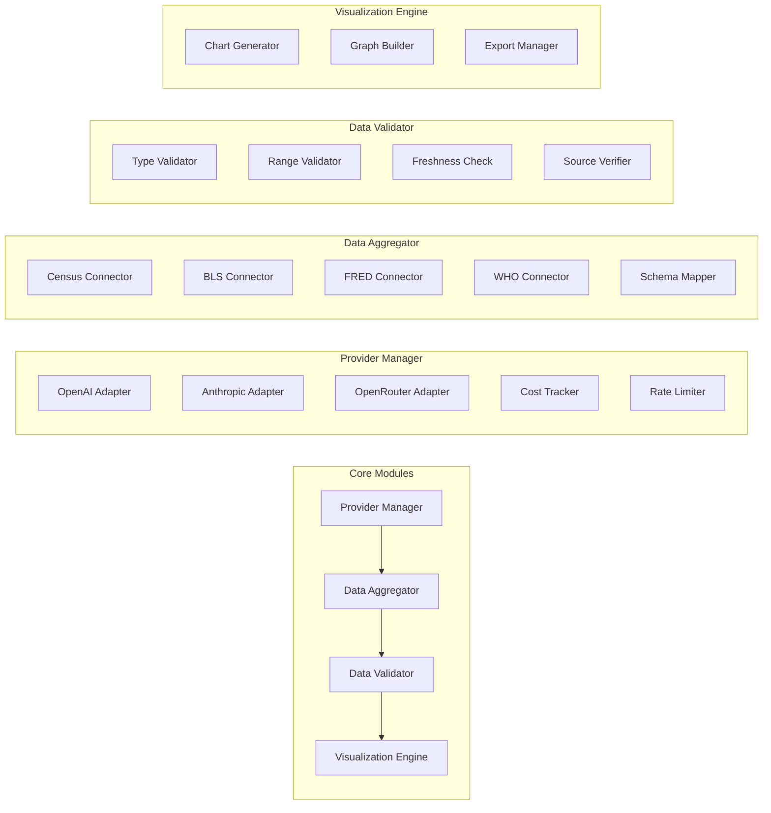

---

## MVP Feature Prioritization

### Phase 1: Core MVP (Week 1-2) - $0/month

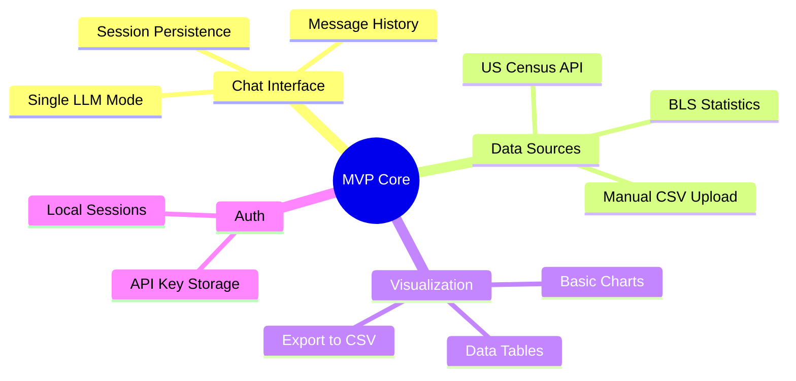

**Features**:
1. ✅ Chat with one LLM at a time (user provides API key)
2. ✅ Query 2-3 government data sources
3. ✅ Basic Chart.js visualizations
4. ✅ Local storage for sessions
5. ✅ Static hosting (zero backend cost)

### Phase 2: Differentiation (Week 3-4) - $0-20/month

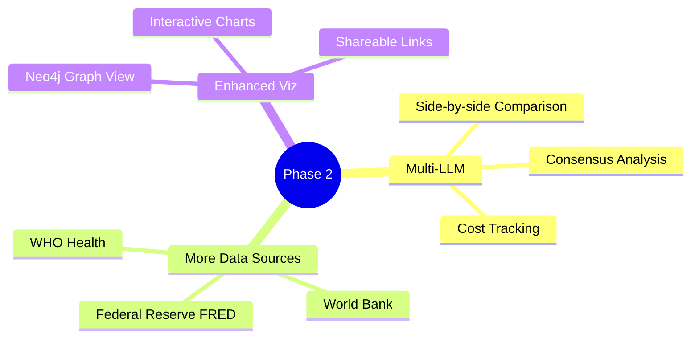

**Features**:
1. ✅ Multi-LLM comparison mode
2. ✅ 5+ data source connectors
3. ✅ Neo4j Aura Free (50K nodes)
4. ✅ Graph visualization with D3/react-force-graph
5. ✅ Firebase Auth (free tier: 50K MAU)

### Phase 3: Monetization (Week 5-8) - Revenue generating

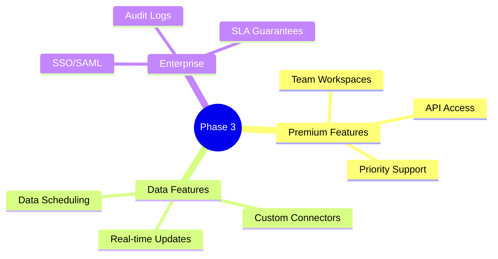

---

## Cost Analysis: Cheapest Deployment Options

### Option A: 100% Free Tier (Recommended for MVP)

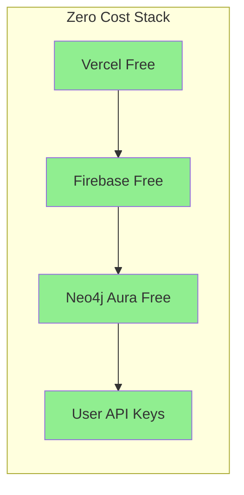

| Service | Free Tier Limits | Cost |
|---------|------------------|------|
| **Vercel** | 100GB bandwidth, 100 deployments/day | $0 |
| **Firebase Hosting** | 10GB storage, 360MB/day transfer | $0 |
| **Firebase Functions** | 2M invocations/month | $0 |
| **Firestore** | 1GB storage, 50K reads/day | $0 |
| **Neo4j Aura Free** | 50K nodes, 175K relationships | $0 |
| **LLM APIs** | User provides own keys | $0 |
| **Cloudflare** | Unlimited bandwidth, basic WAF | $0 |
| **GitHub Actions** | 2000 minutes/month | $0 |
| **Sentry** | 5K errors/month | $0 |
| **Total** | | **$0/month** |

### Option B: Low-Cost Production ($20-50/month)

| Service | Tier | Cost |
|---------|------|------|
| Vercel Pro | Team features | $20/month |
| Neo4j Aura Pro | 1GB, backups | $15/month |
| Sentry Team | 50K errors | $26/month |
| Domain | .app or .io | $12/year |
| **Total** | | **~$62/month** |

### Option C: Scale-Ready ($100-200/month)

| Service | Tier | Cost |
|---------|------|------|
| Vercel Pro | + Analytics | $20 |
| Firebase Blaze | Pay-as-you-go | ~$30 |
| Neo4j Aura Business | 4GB, HA | $65 |
| Sentry Business | 100K errors | $80 |
| Uptime monitoring | Better Uptime | $20 |
| **Total** | | **~$215/month** |

---

## MVP Technical Implementation

### Simplified Architecture (Remove Complexity)

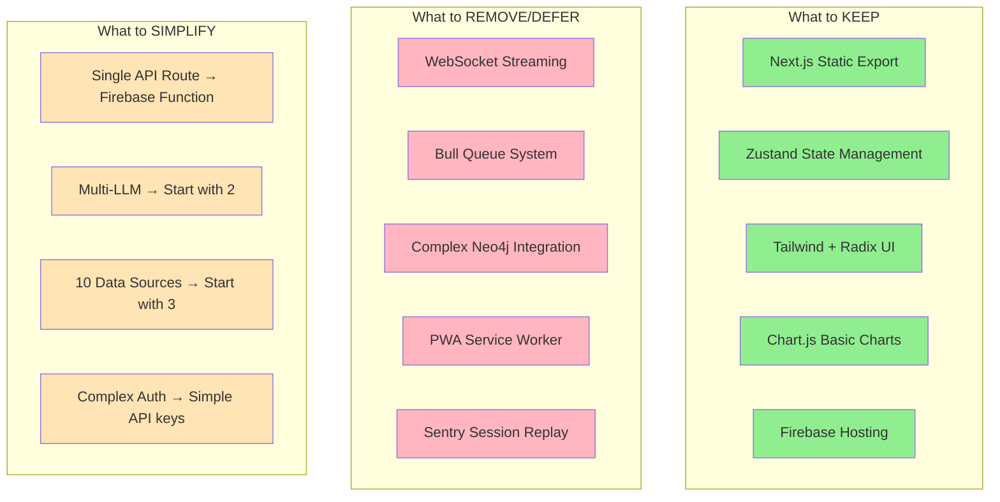

### MVP Data Source Priority

Based on ease of integration and user value:

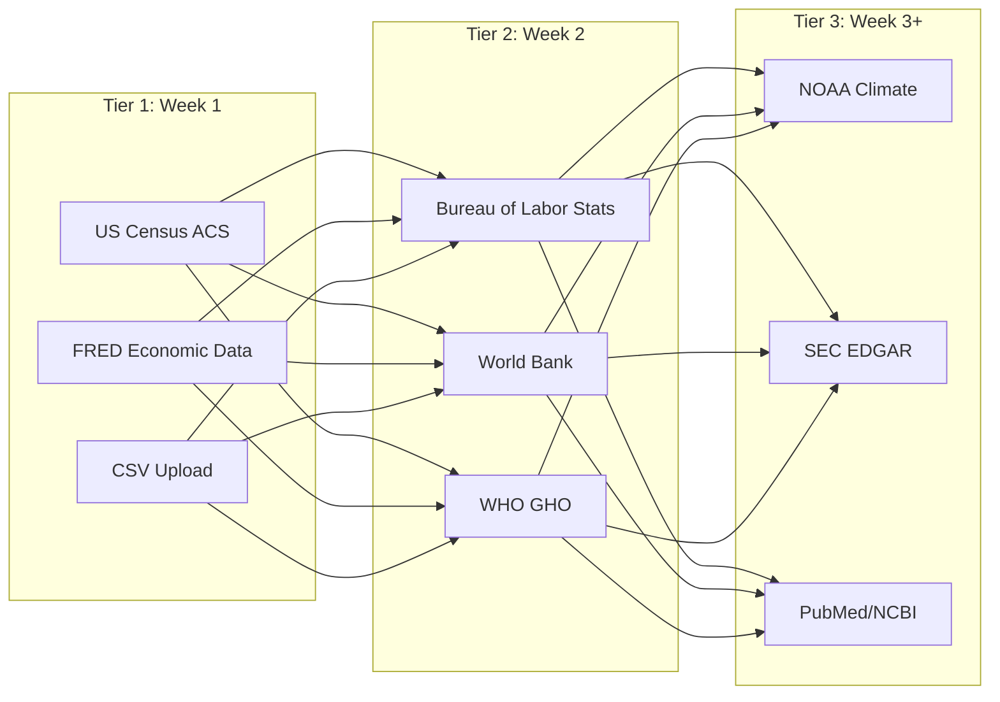

| Data Source | API Key Required | Rate Limit | Complexity |
|-------------|------------------|------------|------------|
| US Census | Free (recommended) | 500/day | Low |
| FRED | Free | 120/min | Low |
| BLS | Free (recommended) | 500/day | Low |
| World Bank | No | None | Very Low |
| WHO GHO | No | None | Low |
| NOAA | Free | 1000/day | Medium |
| SEC EDGAR | No | 10/sec | Medium |

---

## Recommended MVP Implementation

### File Structure Changes

```
statminer/
├── src/
│   ├── app/
│   │   ├── page.tsx           # Main chat interface
│   │   ├── layout.tsx         # App shell
│   │   └── globals.css
│   ├── components/
│   │   ├── Chat/
│   │   │   ├── ChatInterface.tsx
│   │   │   ├── MessageList.tsx
│   │   │   └── ProviderTabs.tsx
│   │   ├── Data/
│   │   │   ├── SourceSelector.tsx
│   │   │   ├── DataPreview.tsx
│   │   │   └── ChartView.tsx
│   │   └── Settings/
│   │       └── ApiKeyManager.tsx
│   ├── lib/
│   │   ├── llm/
│   │   │   ├── providers.ts   # LLM provider implementations
│   │   │   └── types.ts
│   │   ├── data/
│   │   │   ├── sources/
│   │   │   │   ├── census.ts
│   │   │   │   ├── fred.ts
│   │   │   │   └── worldbank.ts
│   │   │   ├── validator.ts   # Data validation
│   │   │   └── transformer.ts
│   │   └── stores/
│   │       └── chat-store.ts
│   └── types/
│       └── index.ts
├── functions/                  # Firebase Functions
│   └── src/
│       ├── chat.ts            # LLM proxy (avoids CORS)
│       └── data.ts            # Data source proxy
└── public/
    └── ...
```

### Key MVP Code Patterns

#### 1. Unified Data Source Interface

```typescript
// src/lib/data/sources/base.ts
export interface DataSource {
  id: string;
  name: string;
  category: 'government' | 'academic' | 'financial' | 'health';
  
  // Core methods
  search(query: string): Promise<DatasetInfo[]>;
  fetch(datasetId: string, params: FetchParams): Promise<DataResult>;
  validate(data: any): ValidationResult;
  
  // Metadata
  getRateLimits(): RateLimitInfo;
  getSchema(datasetId: string): Promise<DataSchema>;
}

// Example implementation
export class CensusSource implements DataSource {
  id = 'census';
  name = 'US Census Bureau';
  category = 'government' as const;
  
  async search(query: string): Promise<DatasetInfo[]> {
    const response = await fetch(
      `https://api.census.gov/data.json?keyword=${encodeURIComponent(query)}`
    );
    return this.parseDatasets(await response.json());
  }
  
  async fetch(datasetId: string, params: FetchParams): Promise<DataResult> {
    const url = this.buildUrl(datasetId, params);
    const response = await fetch(url);
    const data = await response.json();
    
    return {
      source: this.id,
      dataset: datasetId,
      data: this.transform(data),
      metadata: {
        fetchedAt: new Date(),
        rowCount: data.length,
        schema: this.inferSchema(data),
      },
    };
  }
  
  validate(data: any): ValidationResult {
    // Validate data structure, types, ranges
    return { valid: true, errors: [], warnings: [] };
  }
}
```

#### 2. Multi-LLM Comparison (Simplified)

```typescript
// src/lib/llm/comparison.ts
export async function compareResponses(
  prompt: string,
  providers: LLMProvider[],
  dataContext?: DataResult
): Promise<ComparisonResult> {
  const enrichedPrompt = dataContext 
    ? `Context data:\n${JSON.stringify(dataContext.data.slice(0, 100))}\n\nUser question: ${prompt}`
    : prompt;
  
  const responses = await Promise.allSettled(
    providers.map(async (provider) => {
      const start = Date.now();
      const response = await provider.complete(enrichedPrompt);
      return {
        providerId: provider.id,
        response: response.content,
        latency: Date.now() - start,
        tokens: response.usage,
        cost: calculateCost(provider, response.usage),
      };
    })
  );
  
  return {
    prompt,
    responses: responses
      .filter((r): r is PromiseFulfilledResult<ProviderResponse> => 
        r.status === 'fulfilled'
      )
      .map(r => r.value),
    errors: responses
      .filter((r): r is PromiseRejectedResult => r.status === 'rejected')
      .map(r => r.reason),
    consensus: analyzeConsensus(responses), // Find agreement across LLMs
  };
}
```

#### 3. Data Validation Layer

```typescript
// src/lib/data/validator.ts
import { z } from 'zod';

export const DataPointSchema = z.object({
  value: z.union([z.number(), z.string()]),
  date: z.string().optional(),
  source: z.string(),
  confidence: z.number().min(0).max(1).optional(),
});

export const DataResultSchema = z.object({
  source: z.string(),
  dataset: z.string(),
  data: z.array(z.record(z.unknown())),
  metadata: z.object({
    fetchedAt: z.date(),
    rowCount: z.number(),
    freshness: z.enum(['realtime', 'daily', 'weekly', 'monthly', 'annual']).optional(),
  }),
});

export function validateDataResult(data: unknown): ValidationResult {
  const result = DataResultSchema.safeParse(data);
  
  if (!result.success) {
    return {
      valid: false,
      errors: result.error.errors.map(e => ({
        path: e.path.join('.'),
        message: e.message,
      })),
      warnings: [],
    };
  }
  
  // Additional semantic validation
  const warnings: string[] = [];
  
  // Check data freshness
  const fetchedAt = new Date(result.data.metadata.fetchedAt);
  const ageInDays = (Date.now() - fetchedAt.getTime()) / (1000 * 60 * 60 * 24);
  if (ageInDays > 30) {
    warnings.push(`Data is ${Math.floor(ageInDays)} days old`);
  }
  
  // Check for missing values
  const missingRate = calculateMissingRate(result.data.data);
  if (missingRate > 0.1) {
    warnings.push(`${(missingRate * 100).toFixed(1)}% of values are missing`);
  }
  
  return { valid: true, errors: [], warnings, data: result.data };
}
```

---

## Go-to-Market Strategy

### Target Users (MVP)

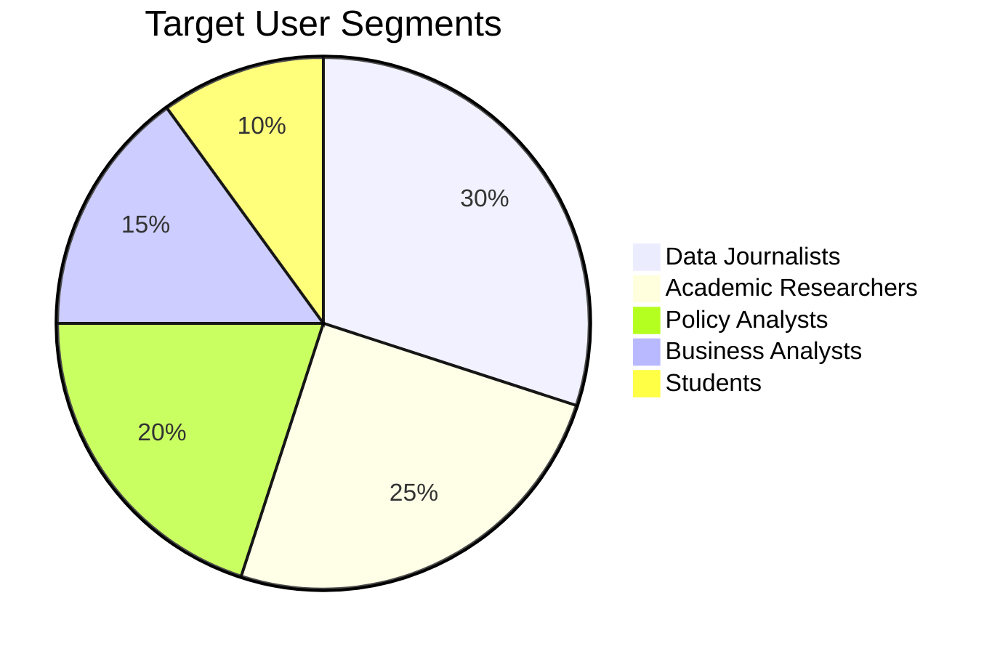

### Launch Timeline

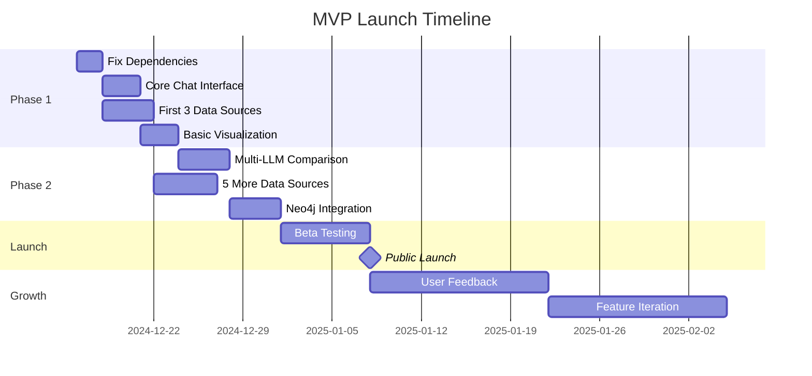

### Pricing Strategy (Future)

| Tier | Price | Features |
|------|-------|----------|
| **Free** | $0 | BYO API keys, 3 data sources, basic charts |
| **Pro** | $19/mo | All data sources, Neo4j graphs, export, priority |
| **Team** | $49/mo/seat | Collaboration, shared workspaces, API access |
| **Enterprise** | Custom | SSO, SLA, custom connectors, on-prem |

---

## Immediate Next Steps (Priority Order)

### Week 1: Foundation

1. **Fix blocking issues** (Day 1)
   - Remove `@radix-ui/react-button`
   - Replace `react-d3-graph` with `react-force-graph-2d`
   - Update `next-auth` to fix vulnerability

2. **Simplify architecture** (Day 2)
   - Remove WebSocket complexity
   - Remove Bull queue
   - Keep static export

3. **Core chat working** (Day 3-4)
   - Single LLM chat functional
   - API key storage in localStorage
   - Basic message history

4. **First data source** (Day 5)
   - US Census API integration
   - Basic data table display

### Week 2: Differentiation

5. **Multi-LLM mode** (Day 6-7)
   - Side-by-side comparison
   - Add Anthropic support

6. **More data sources** (Day 8-9)
   - FRED API
   - World Bank API

7. **Visualization** (Day 10)
   - Chart.js integration
   - Basic chart types

### Week 3: Polish & Launch

8. **Data validation** (Day 11)
9. **Error handling** (Day 12)
10. **Documentation** (Day 13)
11. **Beta launch** (Day 14)

---

## Summary: MVP Definition

### ✅ In Scope (Must Have)

- Single-page chat interface
- Support for 2 LLM providers (OpenAI, Anthropic)
- 3 data source connectors (Census, FRED, World Bank)
- Basic chart visualization (line, bar, table)
- User-provided API keys (localStorage)
- Static hosting on Vercel/Firebase
- Mobile-responsive design

### ❌ Out of Scope (Defer)

- Real-time WebSocket streaming
- User authentication/accounts
- Team collaboration
- Neo4j graph visualization
- PWA offline mode
- Redis/Bull job queues
- Custom data source connectors
- API rate limiting (rely on provider limits)

### 📊 Success Metrics

| Metric | Week 2 Target | Month 1 Target |
|--------|---------------|----------------|
| Unique users | 50 | 500 |
| Chat sessions | 200 | 2,000 |
| Data queries | 100 | 1,000 |
| Avg session time | 5 min | 8 min |

---

*This document should be reviewed weekly and updated based on user feedback and market response.*
